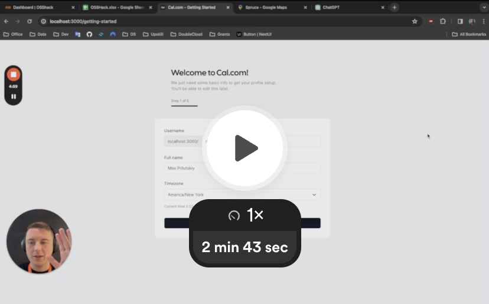

# Cal.com Copilot

Cal.com Copilot helps new users get started with the platform faster and provides a much more personalized first experience, using AI.

Built by [@vrcprl](https://github.com/vrcprl) and [@maxprilutskiy](https://github.com/maxprilutskiy), during the [#OSSHack](https://osshack.com) hackathon in NYC.

---

Our solution improves the onboarding flow and creates a personalized set of events for users, offering more choices to schedule new calls.

Previously, the app randomly generated three events at the end of the user onboarding process. Now, based on the information provided by users during onboarding, the app generates several personalized events.

These include:

* Title
* Description
* Location (in-person, by phone, online), along with specific details such as phone numbers or addresses if provided
* Meeting durations depend on the nature of the meeting (for example, a dinner with friends might last about 2 hours, while a quick chat usually doesn't take more than 15 minutes)
* Minimum notice requirements; if the user specifies different notice times for various event types (e.g., 2 days for in-person and 2 hours for online), the app will configure accordingly
* Automatically identifying personal events (like a call with mom) and hiding them from the list of events visible to business partners

## Demo

Check out our demo 😉

<https://www.loom.com/share/3ca21a10254443b9a01bdc90e78d3a5d>

## What's next

Opportunities for further improvements:

* Adding more features that can be customized based on user input
* Using this solution to create a single event based on the user’s input
