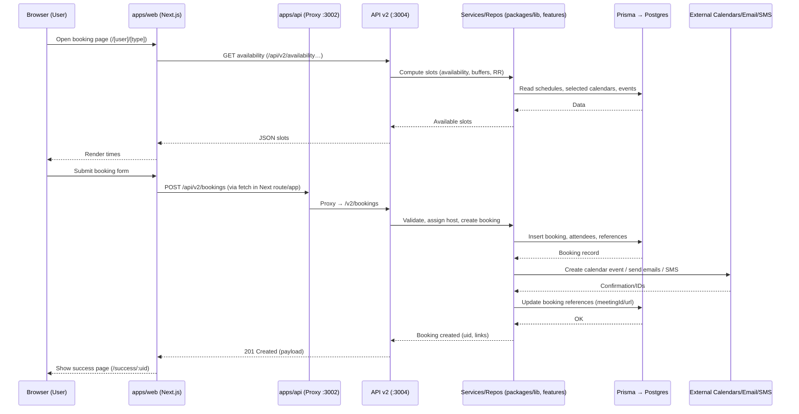
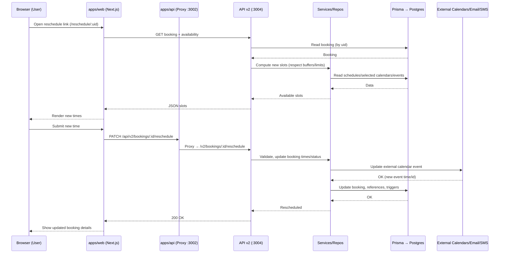
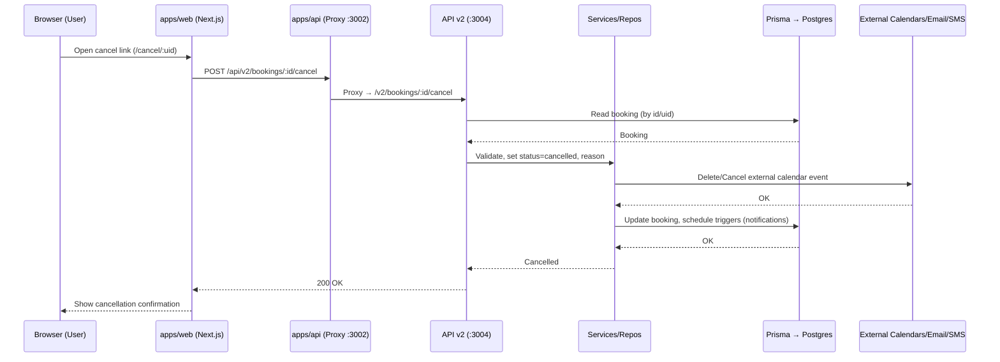

### Booking request flow

This diagram shows a typical booking creation flow in local development.

Notes
- apps/web calls API v2 directly in dev; the `apps/api` proxy forwards `/v2/*` to port 3004.
- Business logic lives in `packages/lib` and `packages/features` (repositories, DI modules, workflows).
- Prisma client is generated from `packages/prisma/schema.prisma` and used server-side.

### Reschedule flow

### Cancel flow

