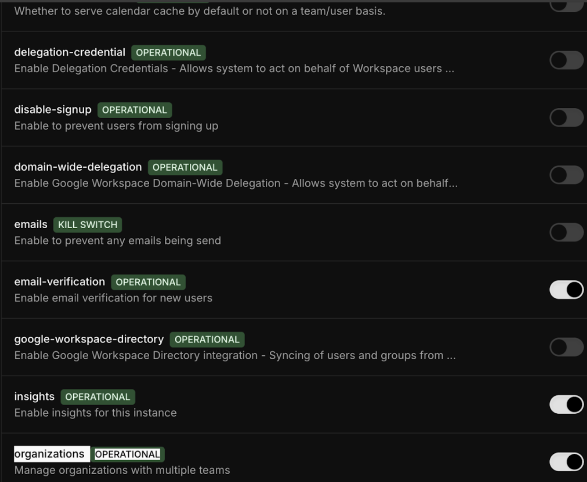
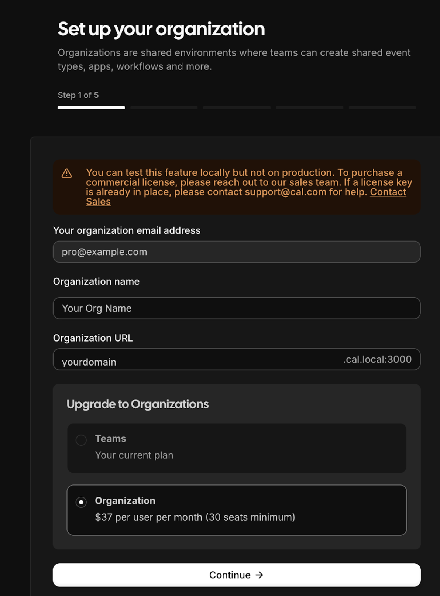

This guide will walk you through setting up and configuring the organizations feature for your self-hosted Cal.com instance. Organizations allow you to create branded, multi-tenant environments within your Cal.com deployment.

## Prerequisites

Before setting up organizations, ensure you have:
- A working Cal.com instance already installed and running
- Admin access to your Cal.com instance 
- Access to modify environment variables and restart your server

## Step 1: Enable Organizations Feature

1. Login as admin using `admin@example.com`
2. Navigate to **Settings** → **Admin** → **Features**   
3. Turn on the **Organizations** feature flag under the Features section


## Step 2: Configure Environment Variables

Set the following environment variables in your `.env` file:

```bash
NEXT_PUBLIC_WEBAPP_URL=http://app.cal.local:3000
NEXT_PUBLIC_WEBSITE_URL=http://app.cal.local:3000
NEXTAUTH_URL=http://app.cal.local:3000
ORGANIZATIONS_ENABLED=1
```

## Step 3: Configure Local DNS

Add the following entry to your hosts file to enable local access:

```bash
127.0.0.1 app.cal.local
```

**Host file locations:**
- **Linux/Mac**: `/etc/hosts`
- **Windows**: `C:\Windows\System32\drivers\etc\hosts`

## Step 4: Start/Restart Development Server

After making the configuration changes, start/restart your development server:

```bash
yarn dev
```

## Step 5: Create an Organization

1. Login using `pro@example.com` (or any user account)
2. Visit `http://app.cal.local:3000/settings/organizations/new`
3. Follow the onboarding steps:
   - Choose a slug for the organization(say `myorg`)
   - Ignore pricing information (not required for self-hosting)
   - Complete the first step (remaining steps can be skipped for now)


<Note>
After creating the organization, you'll be moved inside it and all existing Cal.com links will redirect to the organization URL (e.g., `yourdomain.cal.local:3000`).
</Note>

## Accessing Your Organization

Now if everything above went well, all booking pages for the organization will be accessible at:
```
http://myorg.cal.local:3000/{CAL_LINK}
```

Read more about some other [Organization related environment variables](./understanding-organization-env-variables.mdx) to configure your Cal.com instance to work with multiple organizations.