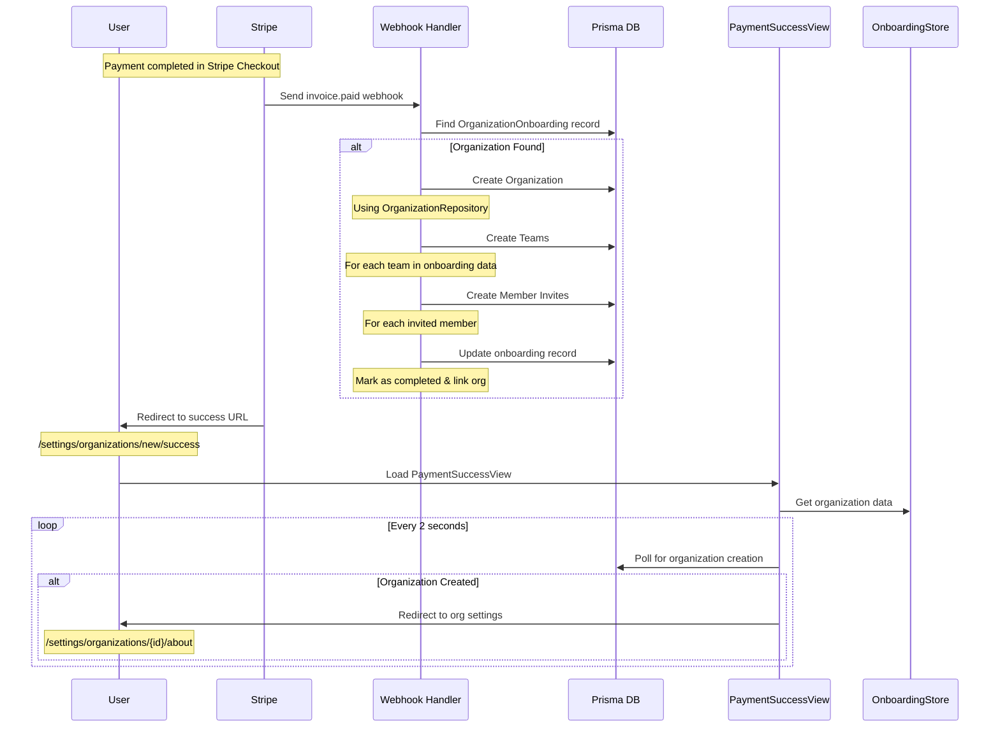

Flow 
- Org Creator's stripeCustomerId is lookedup in DB and reused if found, otherwise it is created in stripe and stored in DB and then used.
- stripeCustomerId uniquely identifies OrganizationOnboarding record.

Admin flow
- Admin lands on onboarding, has the option to set any email address(non-existing, existing) as the owner of the organization. He changes seats/pricePerSeat if needed.
- As he clicks the CTA, he impersonates the user. Impersonation is necessary so that in followup steps, teams are fetched for the user and also the OrganizationOnboarding records the impersonated user's email which then becomes the owner of the organization
  - If the user is non-existing, we create the user first and then impersonate(We could move this implementation to follow-up)
    - But as org isn't created yet, the user is created outside the organization and then on payment confirmation, we move the user to the organization.