# Cal.com Embed Lifecycle Events

This document details the lifecycle events and states of Cal.com embeds, showing the interaction flow between the parent page and the iframe.

## Core Lifecycle Sequence

```mermaid
sequenceDiagram
    participant Parent as Parent (User Page)
    participant Embed as Embed (iframe)
    participant Store as EmbedStore(iframe)
    participant UI as UI Components(iframe)
    
    Note over Parent: embed.js loads
    
    alt Inline Embed
        Parent->>Parent: Create cal-element
        Parent->>Parent: Create iframe (visibility: hidden)
        Parent->>Parent: Show loader
    else Modal Embed
        Note over Parent: No action unless prerender
    end

    alt Prerender Flow
        Note over Parent: Set prerender=true in URL
        Parent->>Store: Set prerenderState="inProgress"
        Note over Store: Limited events allowed
        Parent->>Parent: Create hidden iframe
        Parent->>Parent: load booker(no slots)
        Note over Parent: Wait for connect() call
    end

    alt Modal CTA clicked
        Parent->>Parent: Create cal-modal-box
        Parent->>Parent: Create iframe (visibility: hidden)
        Parent->>Parent: Show loader
    end
    Note over Embed: background: transparent(stays transparent)
    Note over Embed: body tag set to visibility: hidden waiting to be shown
    Note over Embed: iframe webpage starts rendering

    Note over Store: Initialize EmbedStore state
    Store->>Store: Set NOT_INITIALIZED state
    Store->>Store: Initialize UI config & theme

    Note over Parent: Process URL params for prefill
    Parent->>Store: Set prefill data from URL
    Note over Store: Auto-populate form fields

    Embed->>Parent: __iframeReady event
    Note over Parent,Embed: Embed ready to receive messages
    Note over Store: Set state to INITIALIZED

    Store->>UI: Apply theme configuration
    Note over UI: DEPRECATED: styles prop
    Note over UI: Use cssVarsPerTheme instead
    Store->>UI: Apply cssVarsPerTheme

    Embed->>Parent: __dimensionChanged event
    Note over Parent: Calculate and adjust iframe dimensions
    Note over Store: Update parentInformedAboutContentHeight
    
    alt isBookerPage
        Note over Embed: Wait for booker ready state
    end

    Embed->>Parent: linkReady event
    Note over Parent: Changes loading state to done
    Note over Parent: Removes loader
    Note over Parent: Sets iframe visibility to visible

    Parent->>Embed: parentKnowsIframeReady event
    Note over Embed: Makes body visible
    Note over Store: Update UI configuration

    alt Prerendering Active
        Note over Store: Set prerenderState to completed
        Parent->>Store: connect() with new config
        Store->>Store: Reset parentInformedAboutContentHeight
        Store->>Parent: Update iframe with new params
        Note over Store: Remove prerender params
    end

    loop Dimension Monitoring
        Embed->>Embed: Monitor content size changes
        alt Dimensions Changed
            Embed->>Parent: __dimensionChanged event
            Parent->>Parent: Adjust iframe size to avoid scrollbar
        end
    end

    alt Route Changes
        UI->>Store: Update UI state
        Store->>Parent: __routeChanged event
        Parent->>Parent: Handle navigation
        Note over Store: Preserve prefill data
    end
```



## Detailed State Management

### EmbedStore States
- `NOT_INITIALIZED`: Initial state when iframe is created
- `INITIALIZED`: After __iframeReady event is processed
- `prerenderState`: Can be null | "inProgress" | "completed"

### Visibility States
1. Initial Creation:
   - iframe.style.visibility = "hidden"
   - body.style.visibility = "hidden"
   
2. After __iframeReady:
   - iframe becomes visible (unless prerendering)
   
3. After parentKnowsIframeReady:
   - body becomes visible
   - Background remains transparent

## Event Details

1. **Initial Load**
   - embed.js loads in parent page
   - For inline embeds: Creates elements immediately
   - For modal embeds: Waits for CTA click (unless prerendering)

2. **iframe Creation**
   - iframe is created with `visibility: hidden`
   - Loader is shown (default or skeleton)
   - EmbedStore initialized

3. **__iframeReady Event**
   - Fired by: Iframe
   - Indicates: Embed is ready to receive messages
   - Actions:
     - Sets iframeReady flag to true
     - Makes iframe visible (unless prerendering)
     - Processes queued iframe commands

4. **__dimensionChanged Event**
   - Fired by: Iframe
   - Purpose: Maintain proper iframe sizing
   - Triggers:
     - On initial load
     - When content size changes
     - After window load completes

5. **linkReady Event**
   - Fired by: Iframe
   - Indicates: iframe is fully ready for use
   - Requirements:
     - parentInformedAboutContentHeight must be true
     - For booker pages: booker must be in ready state
   - Actions: 
     - Parent removes loader
     - Parent makes iframe visible

6. **parentKnowsIframeReady Event**
   - Fired by: Parent
   - Indicates: Parent acknowledges iframe readiness
   - Actions:
     - Makes body visible
     - For prerendering: marks prerenderState as "completed"

## Prerendering Flow

The prerendering flow follows a special path:

1. Initial State:
   - prerenderState: null

2. During Prerender:
   - prerenderState: "inProgress"
   - Limited events allowed (only __iframeReady, __dimensionChanged)
   - iframe and body remain hidden

3. After Connect:
   - prerenderState: "completed"
   - Full event flow enabled
   - Visibility states updated

## Command Queue System

The embed system implements a command queue to handle instructions before the iframe is ready:

1. Commands are queued if iframe isn't ready:
   ```typescript
   if (!this.iframeReady) {
     this.iframeDoQueue.push(doInIframeArg);
     return;
   }
   ```

2. Queue is processed after __iframeReady event:
   - All queued commands are executed in order
   - New commands are executed immediately

## Error Handling

Page Load Errors:
   - System monitors CalComPageStatus
   - On non-200 status: fires linkFailed event
   - Includes error code and URL information