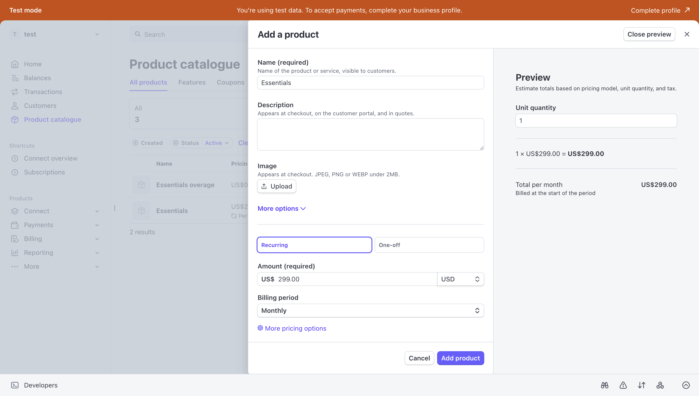

## Local Stripe Setup for Platform Billing Testing

This guide will help you set up Stripe locally to test platform billing subscriptions for different platform plans.

### Prerequisites

- A Stripe account (you can sign up at [stripe.com](https://stripe.com))
- Stripe CLI installed on your machine
- Access to the API v2 `.env` file

### Step 1: Create Stripe Account and Get API Keys

1. Sign up for a Stripe account at [stripe.com](https://stripe.com). You don't need to complete the full account activation process (payment details, company information, etc.) for testing purposes.

2. Access your Stripe Dashboard at [dashboard.stripe.com](https://dashboard.stripe.com)

   

3. Switch to **Test mode** by clicking the toggle in the top left corner of the dashboard.

   

4. Navigate to **Developers** → **API keys** from the left sidebar.

   

5. Copy your **Publishable key**. This will be used as `STRIPE_API_KEY` in your API v2 `.env` file.

   

### Step 2: Install and Configure Stripe CLI

The Stripe CLI is required to listen for webhook events generated by Stripe. This is necessary because the checkout flow triggers events that need to be forwarded to your local API v2 webhook endpoint.

1. Install the Stripe CLI using Homebrew:

   ```sh
   brew install stripe/stripe-cli/stripe
   ```

2. Authenticate the CLI with your Stripe account:

   ```sh
   stripe login
   ```

### Step 3: Configure Environment Variables

Update the following environment variables in your API v2 `.env` file:

#### 3.1. Set Stripe API Key

Add the Publishable key you copied in Step 1:

```env
STRIPE_API_KEY=pk_test_your_publishable_key_here
```

#### 3.2. Generate Webhook Secret

1. Run the following command in your terminal to start listening for Stripe events and generate a webhook signing secret:

   ```sh
   stripe listen --forward-to http://localhost:5555/api/v2/billing/webhook
   ```

2. Copy the webhook signing secret from the command output (it will look like `whsec_...`).

3. Add it to your `.env` file:

   ```env
   STRIPE_WEBHOOK_SECRET=whsec_your_webhook_secret_here
   ```

   > **Note:** Keep this terminal session running while testing, as it forwards Stripe events to your local webhook endpoint.

#### 3.3. Configure Product Price IDs

You need to create products in Stripe and configure their price IDs in your `.env` file. The following environment variables are available:

```env
STRIPE_PRICE_ID_STARTER=
STRIPE_PRICE_ID_STARTER_OVERAGE=
STRIPE_PRICE_ID_ESSENTIALS=
STRIPE_PRICE_ID_ESSENTIALS_OVERAGE=
STRIPE_PRICE_ID_ENTERPRISE=
STRIPE_PRICE_ID_ENTERPRISE_OVERAGE=
```

**To set up products:**

1. In your Stripe Dashboard, navigate to **Products** → **Product catalogue** from the left sidebar.

   

2. Create two products for each plan you want to test:

   - The main plan product (e.g., "Essentials")
   - The overage product for that plan (e.g., "Essentials Overage")

3. For each product:

   - Click on the product in your catalogue
   - Scroll down to find the **Price ID** (it starts with `price_`)
   - Copy the Price ID

4. Add the Price IDs to your `.env` file. For example, if testing the Essentials plan:

   ```env
   STRIPE_PRICE_ID_ESSENTIALS="price_1SXkelSliJQGPobQxR5L8nb5"
   STRIPE_PRICE_ID_ESSENTIALS_OVERAGE="price_1SXl1ZSliJQGPobQR55aQ0j9"
   ```

   > **Note:** You only need to configure the price IDs for the plans you want to test. You can use the same price IDs for multiple products if desired.

### Step 4: Local Development Workaround

> **Important:** This step is only required for local development.

In `apps/api/v2/src/modules/billing/services/billing.service.ts`, ensure that `quantity: 1` is set on line 88. This is a known workaround for local development (this works correctly in production without modification).

### Step 5: Testing the Integration

1. Start the API v2 server:

   ```sh
   yarn start
   ```

   > **Note:** It's recommended to use `yarn start` instead of `yarn dev` for testing Stripe integrations.

2. Start the web application in a separate terminal.

3. Navigate to `/settings/platform/new` in your browser.

4. Create a new platform account.

5. Click on one of the plan cards to initiate the Stripe checkout flow.

6. Use the following test card details:

   - **Card number:** `4242 4242 4242 4242`
   - **Location:** United States (required for this test card)
   - **Expiry date:** Any future date
   - **CVC:** Any 3 digits
   - **ZIP code:** Any 5 digits

7. Complete the checkout process.

8. Verify the integration:

   - The platform dashboard should appear after successful checkout
   - Check the `PlatformBilling` table in your database for a new entry containing:
     - Customer ID
     - Plan details
     - Subscription ID

9. Ensure the Stripe CLI terminal (from Step 3.2) is still running to receive webhook events.
