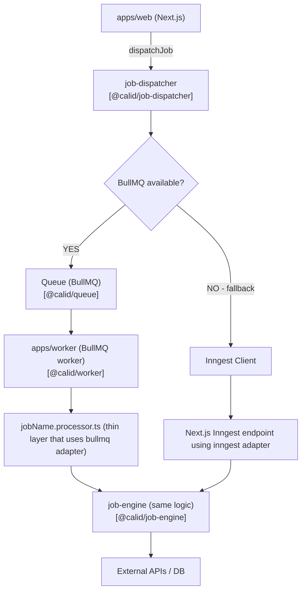

# Worker System Architecture

Our background job system is built to be **scalable, fault-tolerant, and execution-engine agnostic**, using **BullMQ (Redis)** as primary runtime with **Inngest fallback** support.

---

## 1. `@calid/queue` – Queue Infrastructure

Provides queue primitives built on **BullMQ**.

### Includes:

* **Singleton Redis client**
* **Queue definitions**

  * **Default Queue** – High concurrency, IO-heavy, short/medium jobs
  * **Data-Sync Queue** – Low concurrency, long-running, DB-heavy jobs
  * **Scheduled Queue** – Delayed/scheduled jobs
* **Queue Registry** – Central mapping of queue names and instances

---

## 2. `apps/worker` – Background Runtime

Standalone app that consumes and executes jobs.

### Responsibilities:

* Worker bootstrap with graceful shutdown
* Separate workers per queue:

  * Default (high concurrency)
  * Data-sync (low concurrency, long lock time)
  * Scheduled (medium concurrency)
* Thin job processors (no business logic)
* Deployed independently via Docker for horizontal scaling

---

## 3. `@calid/job-engine` – Business Logic

Contains all job processing logic.

* Each job lives in:

  ```
  packages/job-engine/src/<queue>/<job>.service.ts
  ```
* Execution-engine agnostic
* Used by both BullMQ workers and Inngest

---

## 4. `@calid/job-dispatcher` – Dispatch & Fallback

Handles job dispatching with BullMQ-first strategy and Inngest fallback.

### Flow:

1. Check `USE_BULLMQ` flag
2. Verify Redis availability
3. Enqueue job
4. Confirm worker pickup

If any step fails → fallback to Inngest.

Adapters normalize APIs (e.g., `sleep`, `run`) so business logic works with both BullMQ and Inngest without modification.

---
# Architectural Principles

1. Separation of Concerns
   * Infrastructure (queue)
   * Runtime (worker)
   * Business Logic (job-engine)
   * Dispatch Strategy (job-dispatcher)
2. Execution Engine Agnostic
   * Business logic runs on BullMQ or Inngest
3. Fault Tolerant
   * Automatic fallback if workers or Redis fail
4. Horizontally Scalable
   * Worker runs independently via Docker
5. Maintainable
   * Clear folder structure
   * Strict responsibility boundaries
   * No logic leakage into processors

---

   
### Sample Dependency flow:



NOTE: For increasing the number of workers[horizontal scale], we modify the following secrets on github:
1.WORKER_REPLICAS_PROD
2.WORKER_REPLICAS_STAG 
